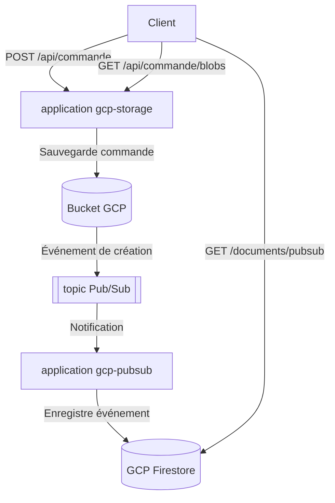

# ☁️ Spring GCP

Ce projet démontre l'intégration de services Google Cloud Platform (GCP) avec Spring Boot. Il est composé de deux applications qui interagissent avec différents services GCP :

1. **gcp-storage** : Application qui permet de sauvegarder et lister des commandes dans Google Cloud Storage.
2. **gcp-pubsub** : Application qui écoute les événements de création de fichiers dans GCP Storage via Pub/Sub et les enregistre dans Firestore.

## ⚒️ Architecture du projet



## 🧰 Fonctionnalités

### gcp-storage

- Sauvegarde des commandes dans un bucket GCP Storage

### gcp-pubsub

- Écoute des événements de création de fichiers dans GCP Storage via Pub/Sub
- Enregistrement des événements dans Firestore

## 📝 Dépendances

### gcp-storage

- Spring Boot Starter Web
- Spring Cloud GCP Starter Storage
- Google Cloud NIO (pour les tests)

### gcp-pubsub

- Spring Boot Starter Web
- Spring Cloud GCP Starter Pub/Sub
- Spring Boot Starter Integration
- Spring Cloud GCP Starter Firestore

## 🚀 Utilisation en local

### Prérequis

- Docker et Docker Compose
- Java 21 ou supérieur
- Maven

### Démarrage des émulateurs

Le projet utilise des émulateurs locaux pour simuler les services GCP. Pour les démarrer :

```bash
docker-compose up -d
```

Cela lancera :
- Un émulateur GCP Storage (fake-gcs-server) sur le port 4443
- Un émulateur GCP Pub/Sub sur le port 38085
- Un émulateur GCP Firestore sur le port 8085

### Démarrage des applications

#### gcp-storage

```bash
cd gcp-storage
mvn spring-boot:run
```

L'application sera accessible sur http://localhost:8082

#### gcp-pubsub

```bash
cd gcp-pubsub
mvn spring-boot:run
```

L'application sera accessible sur http://localhost:8081

### Test des fonctionnalités

Le fichier `request.http` contient des exemples de requêtes pour tester les applications :

1. Création d'une commande :
   ```http
   POST http://localhost:8082/api/commande
   Content-Type: application/json

   {
     "id": "{{$random.uuid}}",
     "nom": "{{$random.alphabetic(10)}}",
     "prix": {{$random.float(0, 300)}}
   }
   ```

2. Récupération des événements stockés dans Firestore :
   ```http
   GET http://localhost:8085/v1/projects/emulator/databases/(default)/documents/pubsub
   ```

## 🗃️ Flux de données

1. Un client envoie une requête POST pour créer une commande à l'application gcp-storage
2. gcp-storage sauvegarde la commande sous forme de fichier texte dans GCP Storage
3. La création du fichier génère un événement qui est publié sur un topic Pub/Sub
4. L'application gcp-pubsub, abonnée au topic, reçoit la notification
5. gcp-pubsub extrait les informations de l'événement et les enregistre dans Firestore
6. Les événements peuvent être consultés directement dans Firestore

Ce flux démontre l'intégration entre différents services GCP et comment ils peuvent être utilisés ensemble pour créer une architecture événementielle.
